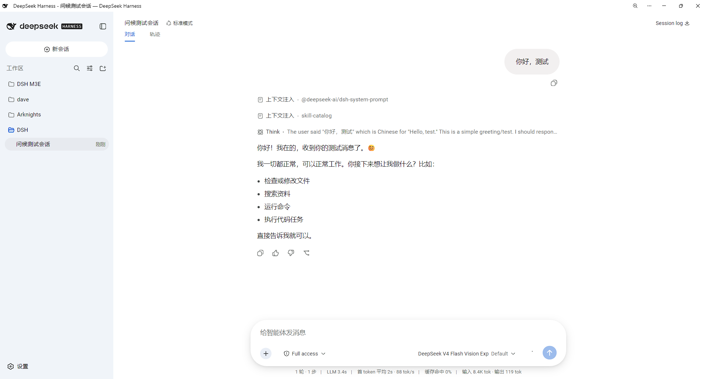
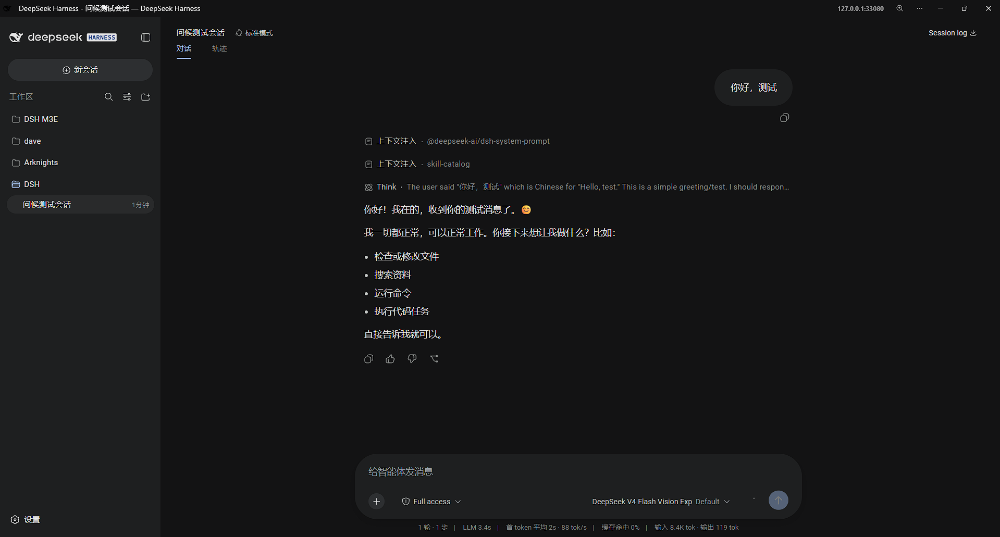

# dsh-gemini-m3e-theme

A **Google Gemini–style Material 3 Expressive theme** for the
[DeepSeek Harness](https://github.com/deepseek-ai) Web UI, shipped as a
persistent **client bundle** plugin.

It restyles the whole web surface toward Gemini's "luminous" look — palette,
typography, shapes, glow, motion and pointer interactions — without touching a
single line of Harness product code. Everything rides the official extension
points, so it installs cleanly, survives restarts, and uninstalls with no trace.

> This repository's README defaults to Chinese: [README.md](README.md)

---

## Preview

<p align="center">
  
  
</p>

---

## Features

| System | What it does |
|---|---|
| **Palette** | 71 dual-tone tokens (light/dark) matching Gemini's `luminous` surface/container/on-surface/primary values; borders are tonal, not drawn |
| **Typography** | Google Sans Text → Google Sans → Roboto → system fallback; Google Sans Mono for code; M3E markdown hierarchy (headings at 400 weight, body line-height 1.5) |
| **Shape** | 40px composer, 40px user bubble, 28px menus with 20px concentric items, 999px pill buttons/triggers, 32px dialogs/settings panel, 16px tool blocks |
| **Glow & motion** | Luminous radial hero glow; menu-in / dialog-in / staggered rise animations on the M3E emphasized curve `cubic-bezier(.05,.7,.1,1)` |
| **Interactions** | Precise point ripple (button-pill & menu scoped), smooth width+height pane transitions via `interpolate-size`, edge-fade + fade-in scrollbars |
| **Elevation** | One soft-shadow spec shared by menus, dialogs and the composer — light on white, present on dark; dialogs drop their border ring |

---

## How it works

The bundle uses two official Harness extension channels:

1. **Theme tokens** — `ctx.theme.overrideTokens(source, tokens)` overrides the
   `--dsw-*` CSS variables (colors, font stacks, markdown type ramp); the
   Gemini palette is always on.
2. **Own styles + DOM JS** — `installStyles()` injects one `<style>` tag
   (shape/motion/glow overrides, matched against product CSS-module class-hash
   fragments), and `installInteractions()` drives ripple, stagger, scroll-fade
   and scrollbar fade-in in the real browser DOM.

> Product-class selectors are the only part that depends on Harness internals.
> See **Caveats** below.

---

## Install

The theme is a **web-profile bundle**, installed with DSH's built-in
`dsh plugin` command (needs Node ≥ 20 and pnpm; it initializes the profile,
installs the dependency, and **registers the package in the
`dsh.profile.bundles` layer list automatically** — no JSON editing):

```bash
dsh plugin add github:makajo/dsh-gemini-m3e-theme     # install straight from GitHub
dsh web                                               # restart web
# Ctrl+F5 to hard-refresh the browser
```

Update: `dsh plugin update dsh-gemini-m3e-theme`; remove:
`dsh plugin remove dsh-gemini-m3e-theme`.

### Offline / manual install (fallback)

Without pnpm, or for full manual control, install the old way: place this
package in the profile's `packages/`, add both the `dependencies` entry and the
`dsh.profile.bundles` entry in `$DSH_HOME/profiles/web/package.json`, run
`pnpm install`, then restart. `lib/client.js` in the repo is the built
artifact, so no build step is needed.

### Live-edit shortcut (Windows junction)

`pnpm` copies deps instead of linking them, so edits to local source do not
propagate to `node_modules`. On Windows you can replace the installed copy with
a directory junction so source edits apply directly:

```powershell
Remove-Item "$env:DSH_HOME\profiles\web\node_modules\dsh-gemini-m3e-theme" -Recurse -Force
New-Item -ItemType Junction -Path "$env:DSH_HOME\profiles\web\node_modules\dsh-gemini-m3e-theme" `
         -Target "$env:DSH_HOME\profiles\web\packages\dsh-gemini-m3e-theme"
```

On macOS/Linux a symlink achieves the same effect.

---

## Develop

- **`src/client.js`** — readable ESM source; the only file you ever edit by hand.
  - palette → `buildColorTokens()`
  - fonts/tool radii → `buildBaseTokens()`
  - type ramp → `buildTypographyTokens()`
  - shape/motion/menus → the `CSS_TEXT` array (`@key@` placeholders, expanded by `expand()`)
  - interactions → `installInteractions()`
  - **product class-hash anchors are registered once in the `T` map at the top** —
    when an upstream rebuild shifts hashes, only T changes; every CSS rule and
    JS selector follows. Same for the `SHADOW`/`EMPH`/`STD` value constants.
- **`lib/client.js`** — what the browser actually loads, generated from `src`
  by esbuild. **Never edit it by hand**; after changing `src` run:

  ```bash
  npm i            # first time: installs the esbuild devDependency
  npm run build    # same as node scripts/build-client.mjs
  ```
- **`scripts/build-client.mjs`** — the esbuild bundling script (JS API, no
  child processes).

After editing, restart `dsh web` and hard-refresh. The bundle `rev` (a content
hash of `lib/client.js`) changes automatically, so the browser fetches the new
build.

---

## Uninstall

1. In `$DSH_HOME/profiles/web/package.json`, remove the
   `"dsh-gemini-m3e-theme"` entry from both `dependencies` and
   `dsh.profile.bundles`.
2. `cd "$DSH_HOME/profiles/web" && pnpm install`
3. Delete `$DSH_HOME/profiles/web/packages/dsh-gemini-m3e-theme/`.
4. Restart `dsh web`.

---

## File map

```
dsh-gemini-m3e-theme/
├── package.json           # dsh.client (web) + dsh.bundle.patch + exports
├── cordis.patch.yml       # inserts the bundle into the host tree
├── lib/
│   ├── client.js          # browser bundle (ModuleLoader format) — live artifact
│   └── service-plugin.js  # host no-op plugin (bundle mount point)
├── src/
│   └── client.js          # ESM source (edit here)
├── scripts/
│   └── build-client.mjs   # esbuild bundling script (the single source of lib; npm run build)
└── README.md
```

---

## Caveats

- **CSS-module class hashes shift on upstream rebuilds.** The theme targets
  product elements by class-hash substrings (e.g. `_7KE1Ra_menu`,
  `_list_19372`). When Harness ships a rebuilt frontend, hashes — and in some
  versions the *format* (`hash_name` → `_name_hash_index`) — change, and
  affected rules silently stop matching. Re-grep the built CSS for the semantic
  names and update the matching values in the `T` registry at the top of
  `src` — every CSS rule and JS selector follows.
- **Windows scrollbars occupy layout width.** The theme reserves a stable
  scrollbar gutter for scrollable menus so the thumb can fade in without a
  width jump.
- **Any node runtime can build.** The bundling script calls esbuild's JS API
  (no child processes), so it works even in restricted shells; `lib/` is
  committed as a build artifact — installing the package needs no build.

---

## License

[MIT](LICENSE)
